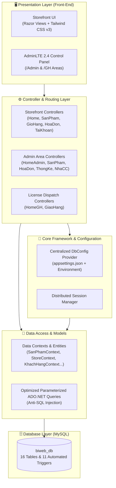

<div align="center">

# 🌐 BIWEB — MARTECH, ERP & AI AGENT PLATFORM
### Nền Tảng Quản Trị & Phân Phối Giải Pháp Martech Cho Doanh Nghiệp Số

[](https://dotnet.microsoft.com/)
[](https://docs.microsoft.com/en-us/dotnet/csharp/)
[](https://dotnet.microsoft.com/apps/aspnet/mvc)
[](https://www.mysql.com/)
[](https://tailwindcss.com/)
[](LICENSE)
[](.github/workflows/ci.yml)

<p align="center">
  <b>Tăng trưởng đột phá với Martech — Phát triển bền vững với ERP & AI Agent.</b><br>
  <i>Hệ sinh thái công nghệ R&D tự chủ phục vụ Media Buyer, Agency Marketing & Doanh nghiệp chuyển đổi số.</i>
</p>

[Khám Phá Tính Năng](#-tính-năng-nổi-bật) • [Kiến Trúc Hệ Thống](#-kiến-trúc-hệ-thống) • [Cài Đặt & Chạy](#-hướng-dẫn-cài-đặt--khởi-chạy-nhanh) • [Tài Khoản Demo](#-phân-quyền--tài-khoản-demo) • [Cơ Sở Dữ Liệu](#-cơ-sở-dữ-liệu-biweb_db)

---

</div>

## 📌 1. Giới Thiệu Dự Án

**BIWEB Platform** là giải pháp phần mềm toàn diện được thiết kế chuyên biệt cho hệ sinh thái phân phối phần mềm Marketing, tự động hóa chiến dịch quảng cáo (Ads Automation), quản trị kho License Key và tích hợp các module ERP & AI Agent cho doanh nghiệp số.

Dự án được xây dựng trên nền tảng **ASP.NET Core MVC** hiệu năng cao, kết hợp cơ sở dữ liệu **MySQL** chuẩn hóa, sở hữu giao diện Responsive hiện đại kết hợp sức mạnh của **Tailwind CSS v3** và bộ nhận diện thương hiệu BIWEB độc quyền (`#0052FF`, `#00C6FF`, `#FF6B00`).

---

## 🚀 2. Tính Năng Nổi Bật

### 🎯 1. Phân Hệ Martech & Tool Tự Động Hóa
- **Kho Giải Pháp Đa Dạng**: Cung cấp các công cụ nuôi nick VIA/Clone số lượng lớn, quét tệp UID đối thủ, tự động hóa chiến dịch Meta/Facebook Ads và quản lý tài nguyên số (BM, Proxy, VIA).
- **Thông Số Kỹ Thuật Chuyên Sâu**: Quản lý chi tiết số luồng xử lý song song (Threads), số tài khoản quản lý (Acc VIA), thời hạn hỗ trợ cập nhật thuật toán Meta và nền tảng tương thích.
- **Trải Nghiệm Mua Sắm Mượt Mà**: Bộ lọc real-time không tải lại trang (Zero-latency Instant Filter), giỏ hàng động, đặt hàng đa phương thức.

### 🤖 2. Phân Hệ AI Agent & Martech Doanh Nghiệp
- Tích hợp các giải pháp AI tự động hóa chăm sóc khách hàng, seeding kịch bản tự nhiên, tối ưu giá thầu Ads theo thời gian thực.
- Cấu trúc module hóa sẵn sàng tích hợp các API thế hệ mới (OpenAI, Gemini, Meta Graph API).

### 📊 3. Phân Hệ Quản Trị Trung Tâm (BIWEB Central Admin)
- **Dashboard Điều Hành**: Biểu đồ thống kê doanh thu theo tháng/năm, tỷ lệ tăng trưởng và phân tích danh mục sinh lời cao nhất.
- **Quản Trị Kho License & Đơn Hàng**: Quy trình duyệt đơn, chuyển giao Key tự động qua phân hệ bàn giao (`/GH`), quản lý nhập kho (`PhieuNhap`) từ đối tác công nghệ.
- **Quản Trị Đối Tác & Nhân Sự**: Phân quyền chi tiết 4 cấp độ bảo mật nghiêm ngặt.

### ⚡ 4. Tự Động Hóa Dữ Liệu Bằng 11 Triggers Nghiệp Vụ
- Tự động tính thành tiền hóa đơn (`cthd`), cập nhật tổng nợ và doanh thu thực tế.
- Tự động đồng bộ hóa kho License và tính toán chiết khấu voucher khuyến mãi.

---

## 🏗️ 3. Kiến Trúc Hệ Thống (Architecture)

Dự án áp dụng mô hình kiến trúc MVC phân tầng kết hợp cấu hình tập trung hiện đại:



---

## 👥 4. Phân Quyền & Tài Khoản Demo

Hệ thống đã tích hợp sẵn dữ liệu mẫu phục vụ kiểm thử toàn diện mọi vai trò:

| Vai Trò | Đường Dẫn Phân Hệ | Email Đăng Nhập | Mật Khẩu | Quyền Hạn Nghiệp Vụ |
| :--- | :--- | :--- | :--- | :--- |
| **Quản trị viên (Super Admin)** | `/Admin/HomeAdmin` | `admin@fbtools.vn` | `123456` | Toàn quyền kiểm soát hệ thống, thống kê doanh thu, duyệt đối tác, phân quyền nhân sự |
| **Nhân viên Cấp Key (Dispatch)** | `/Admin/GiaoHang` | `capkey@fbtools.vn` | `55555555` | Tiếp nhận đơn đặt mua bản quyền, kiểm tra thanh toán, cấp phát License Key |
| **Kỹ thuật viên Martech** | `/Admin/SanPham` | `kythuat@fbtools.vn` | `22222222` | Quản lý kho công cụ, cấu hình số luồng, hỗ trợ kỹ thuật và bảo hành |
| **Khách Hàng Doanh Nghiệp** | `/` (Storefront) | `minhquan.ads@gmail.com` | `123456` | Trải nghiệm mua License, quản lý giỏ hàng, xem lịch sử đơn hàng và hợp đồng |

---

## 🛠️ 5. Hướng Dẫn Cài Đặt & Khởi Chạy Nhanh

### ⚙️ Yêu Cầu Môi Trường
- **Hệ điều hành**: Windows 10/11, macOS hoặc Linux.
- **SDK**: [.NET Core 3.1 SDK](https://dotnet.microsoft.com/download/dotnet/3.1) (hoặc Visual Studio 2019 / 2022 có tích hợp .NET Core 3.1).
- **Cơ sở dữ liệu**: MySQL Server 5.7+ hoặc MariaDB (qua XAMPP, Laragon, Docker hoặc MySQL Community Server).

---

### 💾 Bước 1: Khởi Tạo Cơ Sở Dữ Liệu MySQL
1. Khởi động dịch vụ MySQL (ví dụ qua **XAMPP Control Panel** bấm nút **Start** tại mục MySQL).
2. Mở trình duyệt truy cập phpMyAdmin (`http://localhost/phpmyadmin`) hoặc sử dụng Navicat, DBeaver.
3. Chọn tab **Import** và chọn file:
   ```
   Database/biweb_db.sql
   ```
4. Bấm **Go** để hoàn tất nạp 16 bảng dữ liệu, khóa ngoại, dữ liệu giải pháp mẫu và 11 trigger.

---

### ⚙️ Bước 2: Cấu Hình Chuỗi Kết Nối Tập Trung

Toàn bộ kết nối database của BIWEB được quản lý duy nhất tại [appsettings.json](file:///d:/.SonicLee/biweb/DoAn-FW/appsettings.json):

```json
{
  "ConnectionStrings": {
    "DefaultConnection": "server=localhost;port=3306;database=biweb_db;uid=root;password=;"
  }
}
```
> 💡 **Mẹo**: Nếu MySQL của bạn đặt mật khẩu cho tài khoản `root` hoặc dùng cổng khác (ví dụ `3307`), chỉ cần sửa duy nhất tại `appsettings.json`, toàn bộ hệ thống sẽ tự động cập nhật ngay lập tức mà không cần sửa code C#!

---

### ▶️ Bước 3: Khởi Chạy Ứng Dụng

#### Cách 1: Sử dụng Terminal (.NET CLI)
```bash
# Di chuyển vào thư mục dự án
cd DoAn-FW

# Chạy ứng dụng
dotnet run
```
Truy cập trình duyệt:
- **Trang chủ BIWEB**: [http://localhost:5000](http://localhost:5000) hoặc [https://localhost:5001](https://localhost:5001)
- **Trang Quản trị Admin**: [http://localhost:5000/Admin/HomeAdmin/Index](http://localhost:5000/Admin/HomeAdmin/Index)

#### Cách 2: Sử dụng Visual Studio
1. Nhấp đúp mở file giải pháp [Biweb.sln](file:///d:/.SonicLee/biweb/Biweb.sln).
2. Chọn profile khởi chạy **Biweb** hoặc **IIS Express**.
3. Nhấn **F5** (hoặc `Ctrl + F5`) để bắt đầu Debug.

---

## 📂 6. Cấu Trúc Thư Mục Repository

```
biweb/
├── .github/
│   └── workflows/
│       └── ci.yml               # Tự động hóa CI/CD kiểm tra Build trên GitHub Actions
├── Database/
│   ├── biweb_db.sql             # CSDL chính thức (16 bảng, dữ liệu mẫu & 11 triggers)
│   ├── website_dienthoai.sql    # Bản sao lưu tương thích dữ liệu gốc
│   └── README.md                # Tài liệu chi tiết lược đồ CSDL & bảng mã
├── Docs/
│   └── BIWEB_Profile_Project.pdf # Hồ sơ năng lực & tài liệu thiết kế dự án
├── DoAn-FW/                     # Mã nguồn ứng dụng chính (ASP.NET Core Web Project)
│   ├── Areas/
│   │   ├── Admin/               # Phân hệ Quản trị (Kho Tool, Doanh số, Đối tác)
│   │   └── GH/                  # Phân hệ Cấp License Key & Giao hàng
│   ├── Controllers/             # Bộ điều hướng Storefront (Home, SanPham, GioHang...)
│   ├── Infrastructure/          # Tầng kiến trúc cốt lõi (DbConfig tập trung)
│   ├── Models/                  # Mô hình thực thể & Context truy xuất MySQL
│   ├── Views/                   # Giao diện người dùng Storefront BIWEB
│   ├── wwwroot/                 # Tài nguyên tĩnh (CSS, JS, Fonts, Images)
│   ├── appsettings.json         # Cấu hình chuỗi kết nối & môi trường
│   ├── DoAn-FW.csproj           # Cấu hình project .NET Core (Output: Biweb.dll)
│   └── Startup.cs               # Cấu hình Dependency Injection, Session & Routing
├── .editorconfig                # Chuẩn hóa định dạng code đa nền tảng
├── .gitattributes               # Chuẩn hóa xử lý xuống dòng Git
├── .gitignore                   # Loại trừ file rác, bin/obj & cache biên dịch
├── Biweb.sln                    # Visual Studio Solution chuẩn cho BIWEB
├── CONTRIBUTING.md              # Quy chuẩn đóng góp mã nguồn
├── LICENSE                      # Giấy phép mã nguồn mở MIT
└── README.md                    # Tài liệu hướng dẫn chính thức của dự án
```

---

## 💎 7. Điểm Cải Tiến Về Mặt Framework

- [x] **Xóa bỏ hoàn toàn Hardcode Connection String**: Chuyển đổi toàn bộ 12 Contexts/Models sang cơ chế cấu hình tập trung qua `DbConfig` và `appsettings.json`.
- [x] **Đổi tên & Chuẩn hóa Định Danh**: Khắc phục triệt để tình trạng lệch tên giữa CSDL, giao diện và tài liệu. Thống nhất định danh toàn diện thương hiệu **BIWEB**.
- [x] **Tối ưu Hóa Project File**: Dọn dẹp các mục rác trong `.csproj`, cấu hình output assembly chuẩn `Biweb.dll`.
- [x] **Sẵn Sàng Cho GitHub**: Bổ sung đầy đủ `.gitignore`, `.gitattributes`, `.editorconfig`, `LICENSE`, `CONTRIBUTING.md` và quy trình CI tự động.
- [x] **Dọn Dẹp Build Artifacts**: Tách biệt tài liệu dung lượng lớn, loại bỏ `bin/`, `obj/` để repository siêu nhẹ và clone nhanh chóng.

---

## 📜 8. Bản Quyền & Giấy Phép

Dự án được phân phối dưới giấy phép mã nguồn mở **MIT License** — xem chi tiết tại [LICENSE](LICENSE).

<div align="center">
  <sub>Phát triển bởi đội ngũ công nghệ <b>BIWEB Platform</b>. © 2026 All Rights Reserved.</sub>
</div>
